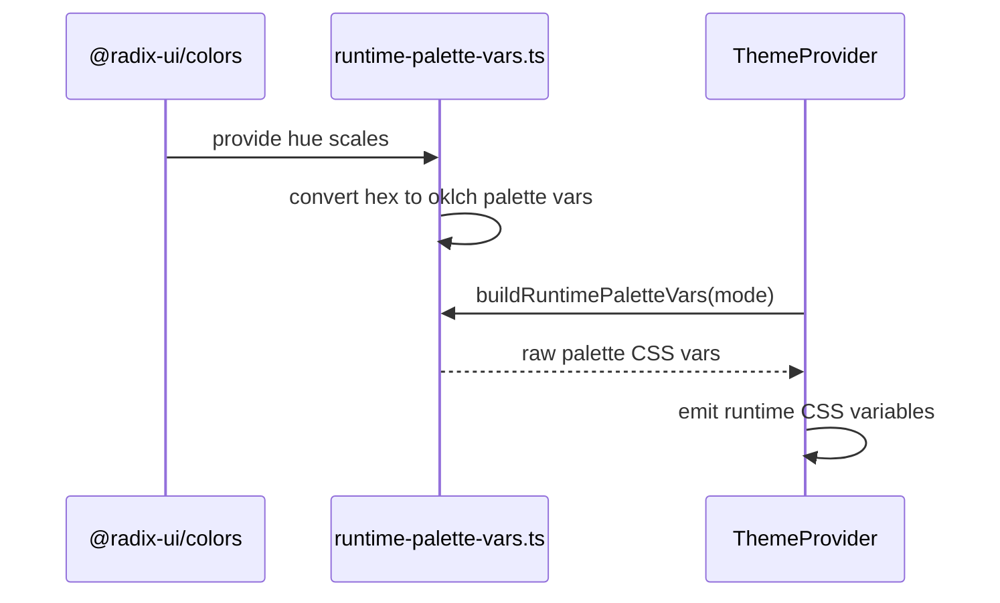
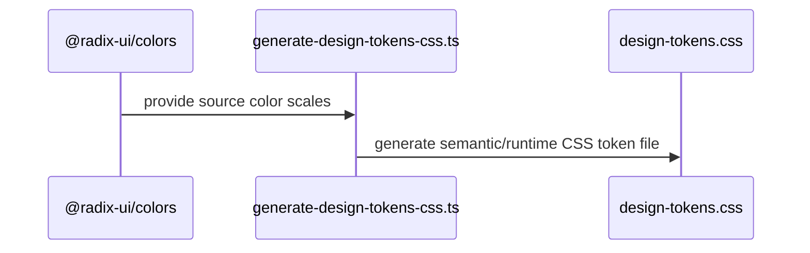

## Theme Token Flow

Current state:

- `design-tokens.css` is generated and used at runtime

### Runtime Sequence

### Generation Sequence

### Explanation

`@radix-ui/colors` is the color source.

`generate-design-tokens-css.ts` generates `packages/ui/src/theme/design-tokens.css`.

`design-tokens.css` is allowed on the runtime path because it is a runtime CSS asset. The browser uses the CSS variables defined there.

`runtime-palette-vars.ts` derives runtime palette values directly from `@radix-ui/colors`.

`ThemeProvider` uses `runtime-palette-vars.ts` and emits runtime CSS vars.

### Rule

- If runtime needs token data, derive it from source.
- If a file is just an export artifact, keep it off the runtime path.
